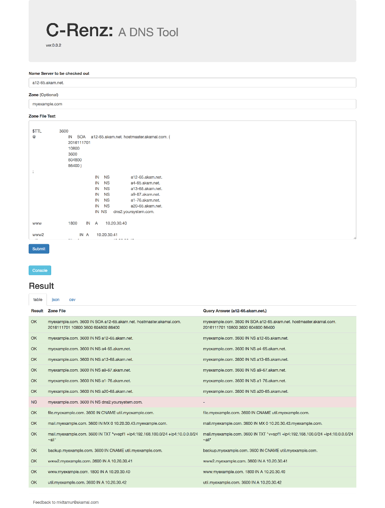
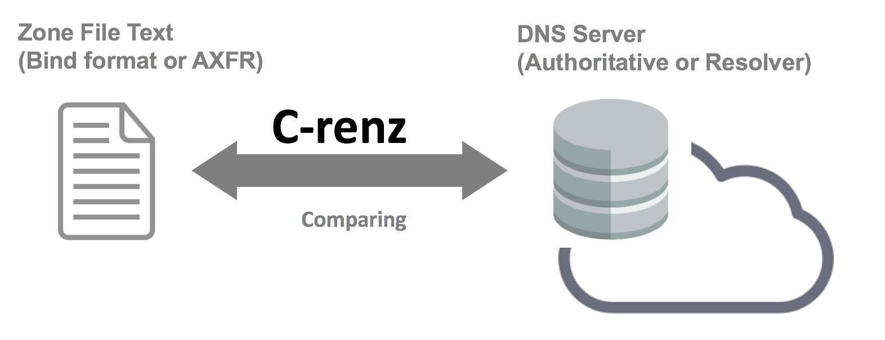
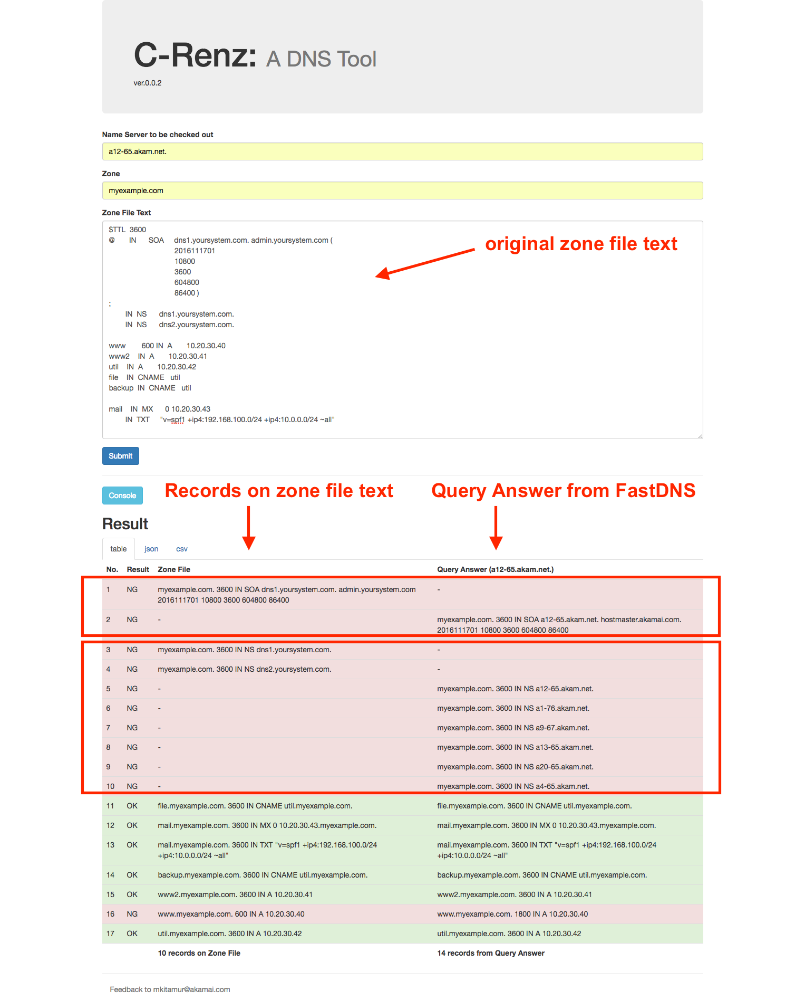

# crenz
A DNS tool: Comparator tool b/w Record Entry aNd Zone-file, sort of DNS checking tool.



## Introduction

C-Renz is "A Comparator tool b/w Record Entry and Zone-file, sort of DNS checking tool.

Simply, C-renz compares the DNS resource records between zone file and query answer. More precisely, C-renz captures the zone text file --- supporting Bind format and AXFR format, makes DNS query from records on that zone file, sends out to the target DNS server, and then finally compares the results between records on zone file and that from query answer.



## Installation

Easiest way is to build docker image from this source.

### 1. Install [Docker](https://www.docker.com) 

### 2. Get code from git repo

```
$ git clone https://github.com/ktmrmshk/crenz.git
```

### 3. Build Docker image

```
$ cd crenz
$ ls
LICENSE			README.md		doc			requirements.txt
Procfile		crenz			docker			tests

$ docker build -t sdtool/crenz -f docker/Dockerfile .
...
Successfully tagged sdtool/crenz:latest

$ docker images
REPOSITORY          TAG                 IMAGE ID            CREATED             SIZE
sdtool/crenz        latest              4316b746bc5c        14 seconds ago      240MB
```

### 4. Run docker

Mapping port number localhost:5001 => docker container:5000

```
$ docker run --rm -d -p5001:5000 sdtool/crenz

$ docker ps
CONTAINER ID        IMAGE               COMMAND                  CREATED             STATUS              PORTS                                NAMES
3d00951443d8        sdtool/crenz        "gunicorn -b 0.0.0.0…"   About an hour ago   Up About an hour    0.0.0.0:5001->5000/tcp               stupefied_frankli 
```

### 5. Open in browser

Access to `http://localhost:5001`


### 6. Shutdown

```
$ docker stop 3d00951443d8
```


## Usage

Very easy to use:

1. type DNS server name you wanna to check out in "Name Server to be checked out" field. (i.e. `a12-65.akam.net`)
1. type Zone name in "Zone" filed. (i.e. `myexample.com` )
1. copy and paste zone file text into "Zone File Text" Field like screenshot above. 
1. press "Submit" and result will be shown bottom of the page.


## Usecase

In EdgeDNS primary zone integration, AXFR or Bind-formatted zone file of current DNS is usually provided from customer. To setup primary zone in EdgeDNS, you may edit the zone file provided to adapt the EdgeDNS zone config including SOA and NS records. After uploading zone file and propagated over the EdgeDNS platform, you need to check if these zone files are correctly registered.


In these situation, using C-renz, you can check the diffs between original zone file, namely, original zone record on previous DNS, and EdgeDNS you integrate at this time.


For example, here's a original zone file the customer is using on current DNS service:


```
$TTL  3600
@       IN      SOA     dns1.yoursystem.com. admin.yoursystem.com (
                2016111701
                10800
                3600
                604800
                86400 )
;
        IN  NS      dns1.yoursystem.com.
        IN  NS      dns2.yoursystem.com.
 
www 600 IN  A       10.20.30.40
www2    IN  A       10.20.30.41
util    IN  A       10.20.30.42
file    IN  CNAME   util   
backup  IN  CNAME   util
 
mail    IN  MX      0 10.20.30.43
        IN  TXT     "v=spf1 +ip4:192.168.100.0/24 +ip4:10.0.0.0/24 ~all"
```

Suppose following EdgeDNSs are assigned:

* a12-65.akam.net.
* a4-65.akam.net.
* a13-65.akam.net.
* a9-67.akam.net.
* a1-76.akam.net.
* a20-65.akam.net.

After EdgeDNS integration at this zone, you can check and compare zone records on EdgeDNS against the original zone records with C-Rens. See following screenshot to do this.




From result, it found that:

* SOA records are changed (not matched b/w original zone file and EdgeDNS)
* NS records are changed (not matched b/w original zone file and EdgeDNS)
* other records are same other than a record at L.16
* the record at L.16 is not matched because of different TTL

C-renz would help you out for EdgeDNS integration and for FF6!
